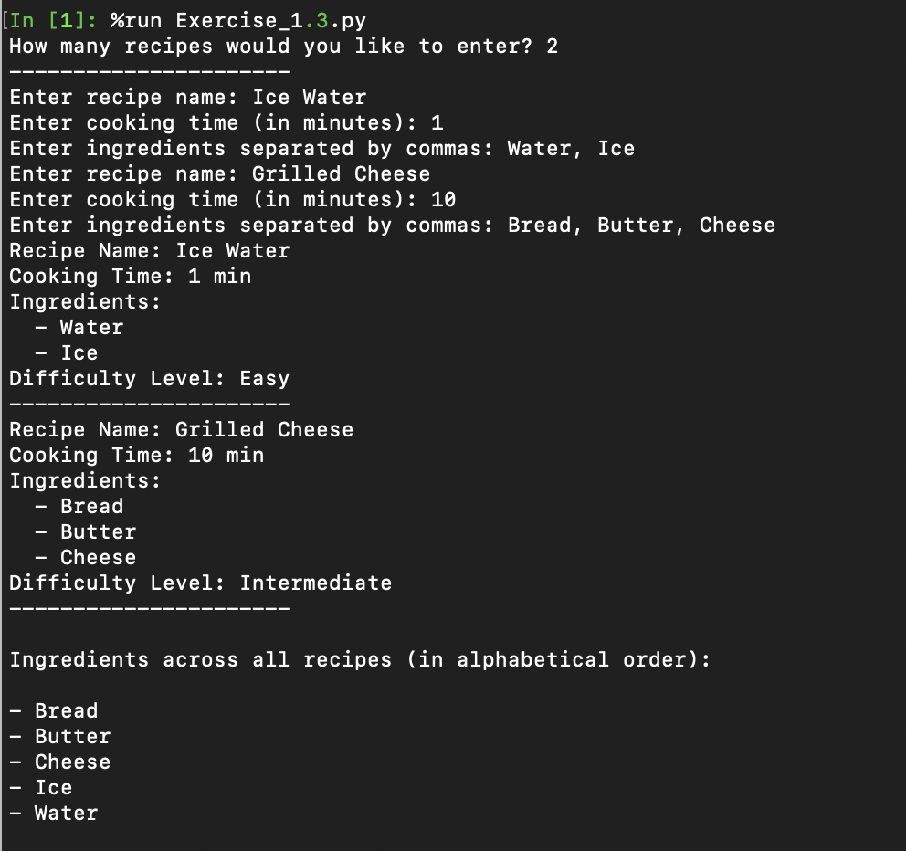

# Exercise 3

This script allows you to input multiple recipes, and it will store them along with their ingredients. Once you've entered all the desired recipes, the script will display each one, including its calculated difficulty level.

## Step 1: Enter the Number of Recipes

Start by speciifying how many recipes you would like to input

## Step 2: Input Recipe Details

For each recipe:

- Provide the recipe name
- List the ingredients, seperated by commas
- Specify the cooking time in minutes

## Step 3: Review the Recipes and Difficulty Levels

Once all recipes have been inputted, the scripts will display:

- Recipe name
- Ingredients 
- Cooking time
- Calculated difficulty level

## Difficulty Levels

The difficulty of a recipe is calculated based on its cooking time and the number of ingredients:

- **Easy**: Less than 10 minutes and fewer than 4 ingredients.
- **Medium**: Less than 10 minutes but 4 or more ingredients.
- **Intermediate**: 10 minutes or longer but fewer than 4 ingredients.
- **Hard**: 10 minutes or longer and 4 or more ingredients.