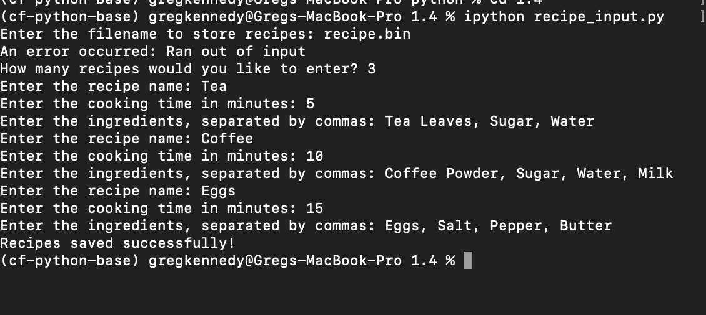
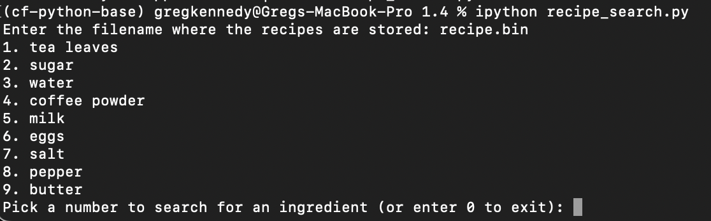
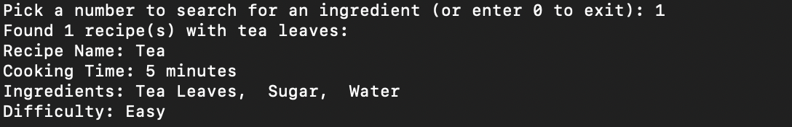

# Exercise 4

This system consists of two Python scripts: recipe_input.py for entering recipes, and recipe_search.py for searching recipes based on ingredients. Here's how to use each:

## Step 1: Inputting Recipes with recipe_input.py

Start by Specifying the filename where you would like the data to be stored "recipe.bin"

Enter The number of recipes then follow the prompts:

- Provide the recipe name
- List the ingredients, seperated by commas
- Specify the cooking time in minutes

## Step 2: Searching for Recipes with recipe_search.py

Start by specifying the filename where the data is located "recipe.bin" this will show a list of ingredients.

Choosing a number will display any recipe with the chosen ingredients.

