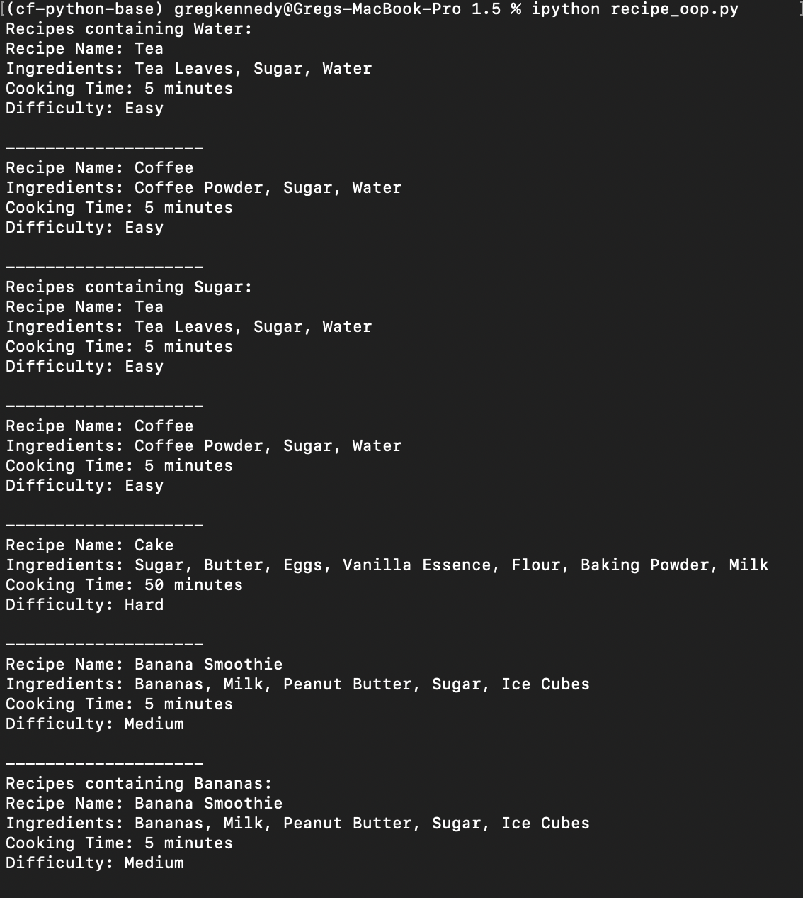

# Exercise 5
 
The recipe_oop.py script creates instances of the Recipe class for various dishes. It then demonstrates the ability to search for recipes based on an ingredient, printing the relevant details for each matching recipe.

