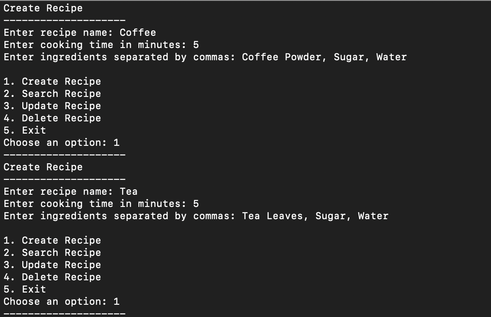
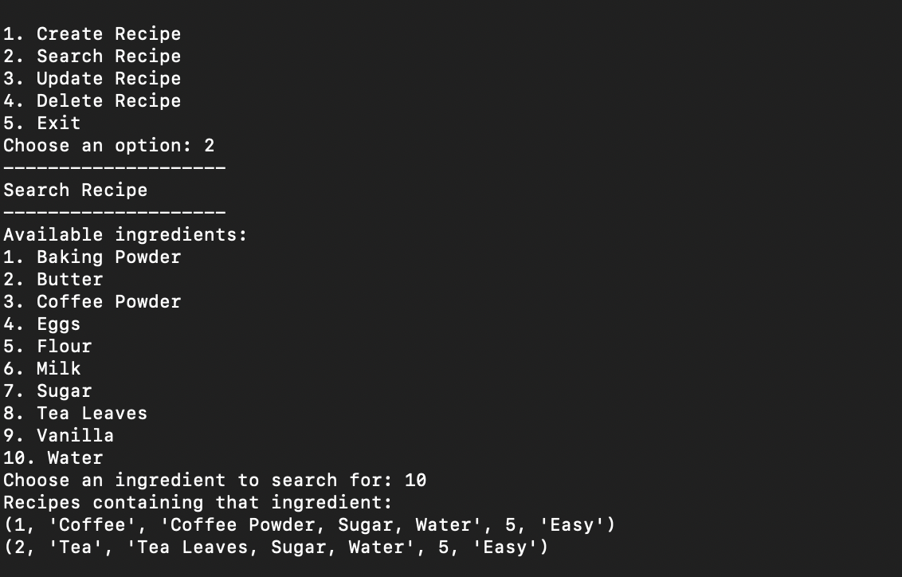
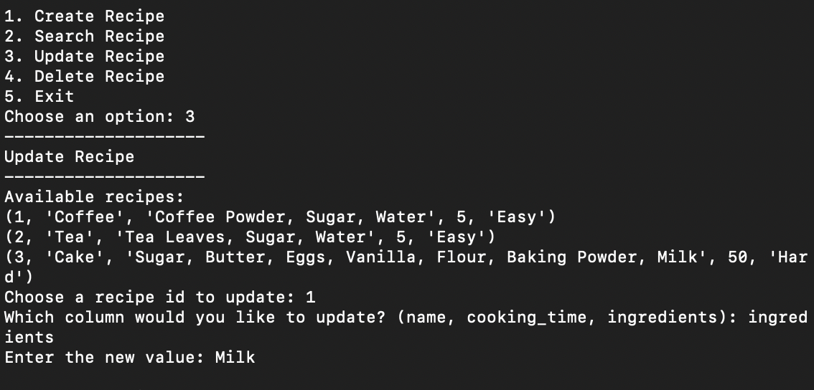
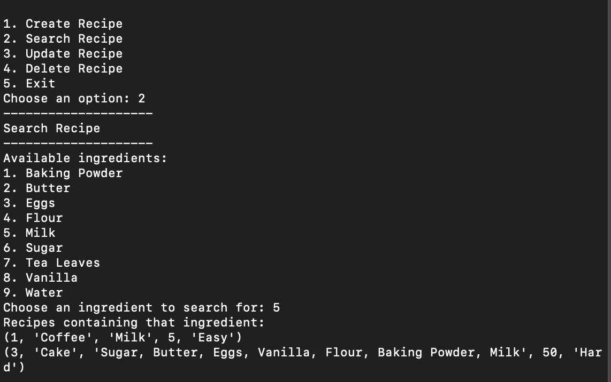
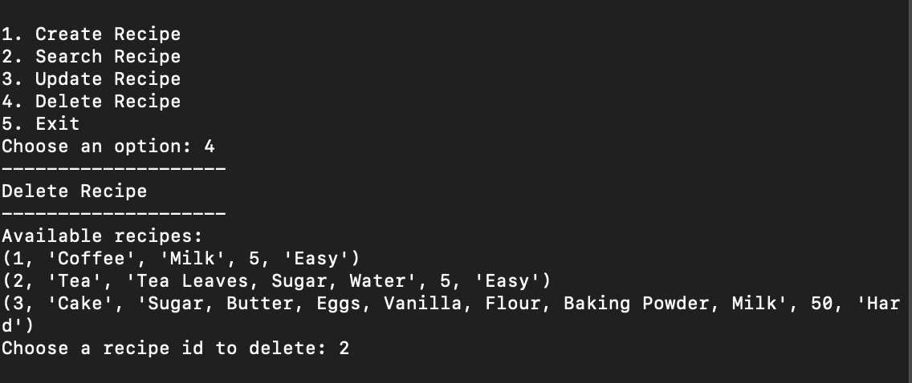

# Recipe Management System with Python and MySQL

## Step 1: Create & Connect Database

- **Import Module**: Import `mysql.connector`.
- **Initialize Connection**: Create a `conn` object.
  - **Hostname**: `localhost`
  - **Username**: `cf-python`
  - **Password**: `password`
- **Initialize Cursor**: Create a cursor object from `conn`.
- **Create Database**: Use `CREATE DATABASE IF NOT EXISTS task_database`.
- **Switch Database**: Use the `USE` statement to switch to `task_database`.
- **Create Table**: Create a table called `Recipes` with specified columns.

## Step 2: The Main Menu

Implement a main menu using a `while` loop in a function called `main_menu()`:

1. **Add a Recipe**: Calls `create_recipe()`
2. **Search for a Recipe**: Calls `search_recipe()`
3. **Modify a Recipe**: Calls `update_recipe()`
4. **Delete a Recipe**: Calls `delete_recipe()`

## Step 3: Creating a Recipe

- Collect recipe details.
- Calculate the difficulty using `calculate_difficulty()`.
- Insert into `Recipes` table.

## Step 4: Searching for a Recipe

- Display a list of all unique ingredients.
- Allow the user to select an ingredient.
- Search and display the recipes containing the selected ingredient.

## Step 5: Updating a Recipe

- Display all recipes.
- User selects a recipe by its `id`.
- Update the selected column and recalculate difficulty if needed.

## Step 6: Deleting a Recipe

- Display all recipes.
- User selects a recipe by its `id` for deletion.
- Delete the selected recipe from the database.

