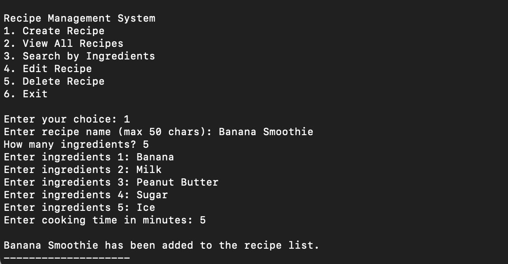
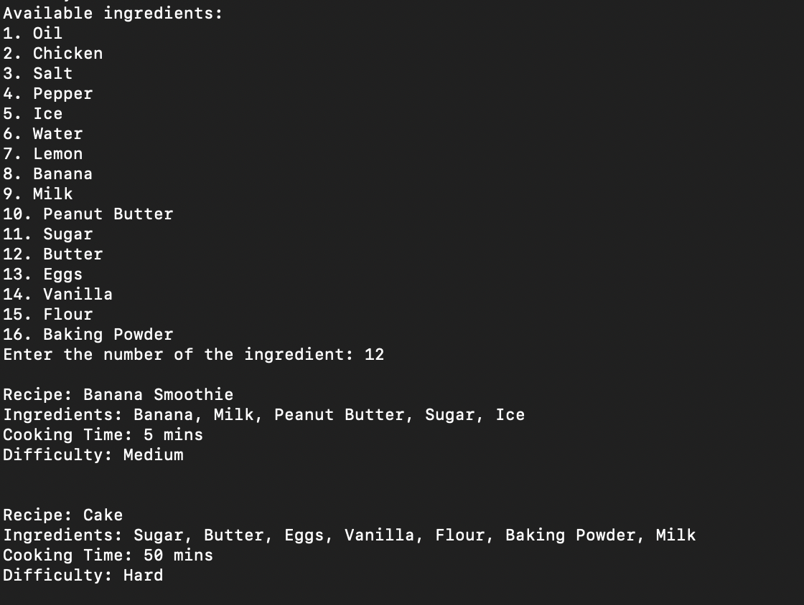
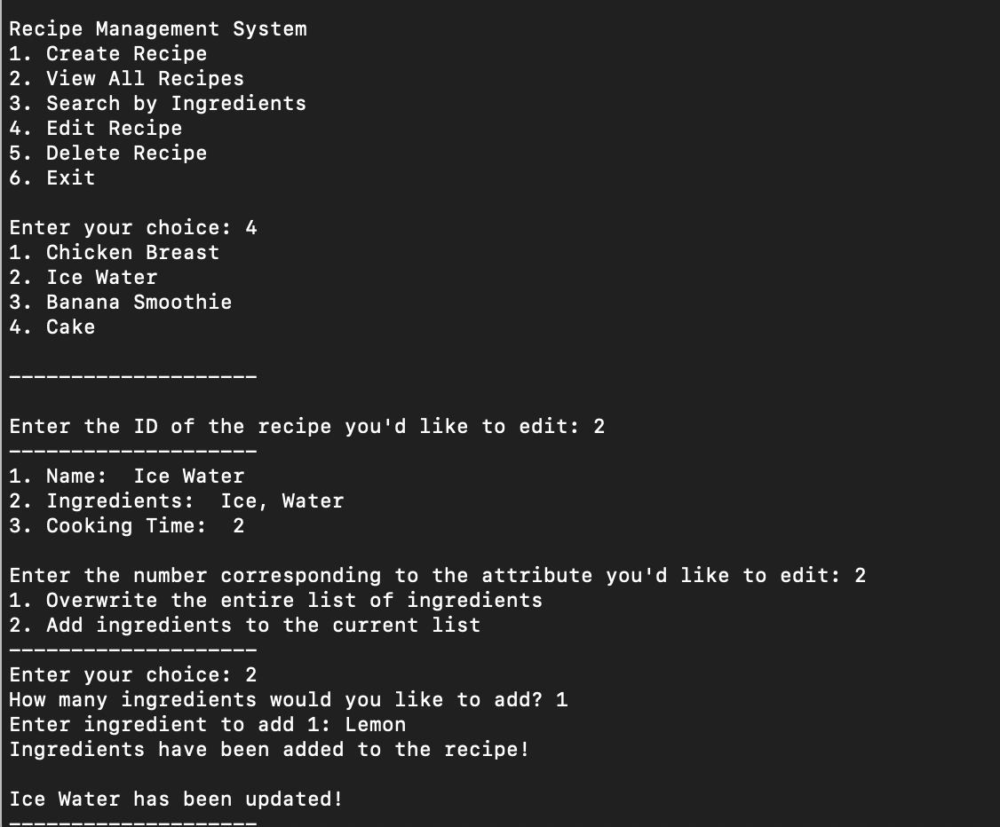
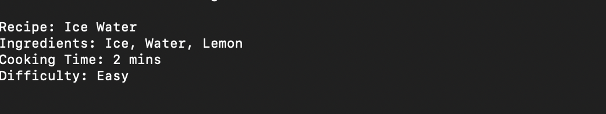
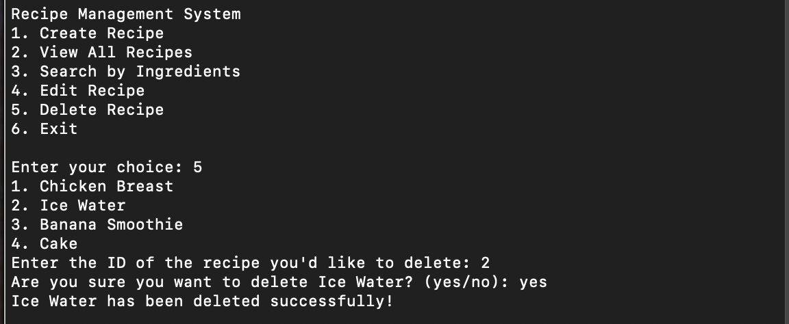
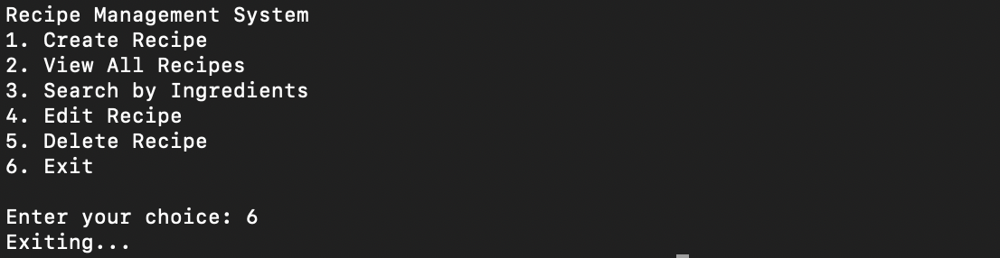

# Achievement 1: Final Exercise - Recipe App

## Step 1: Set Up Your Script & SQLAlchemy

- **Import Necessary Modules**: Especially SQLAlchemy related ones.
- **Set Up SQLAlchemy**: 
  - **MySQL Credentials**: Ensure you've set them up.
- **Create Engine & Session**: Establish a connection and a session.

## Step 2: Create Your Model and Table

- **Declarative Base**: Store your declarative base class into `Base`.
- **Define Recipe Class**:
  - **Table Name**: `final_recipes`
  - **Columns**: `id`, `name`, `ingredients`, `cooking_time`, `difficulty`.
  - **Methods**: Implement the `__repr__`, `__str__`, `calculate_difficulty()`, and `return_ingredients_as_list()`.
- **Initialize Table**: Create the table in your database.

## Step 3: Define your Main Operations as Functions

- **Function 1**: `create_recipe()`
  - **Actions**: Collect recipe details, validate inputs, convert ingredients to a string, and add the entry to the database.
  

- **Function 2**: `view_all_recipes()`
  - **Actions**: Retrieve all recipes and display them.

  
  
- **Function 3**: `search_by_ingredients()`
  - **Actions**: Search for recipes based on their ingredients.

  
  
- **Function 4**: `edit_recipe()`
  - **Actions**: Edit details of an existing recipe.

  
  
  
- **Function 5**: `delete_recipe()`
  - **Actions**: Remove a recipe from the database.

  

- **Termination**: Close session and engine when the user chooses to exit.

