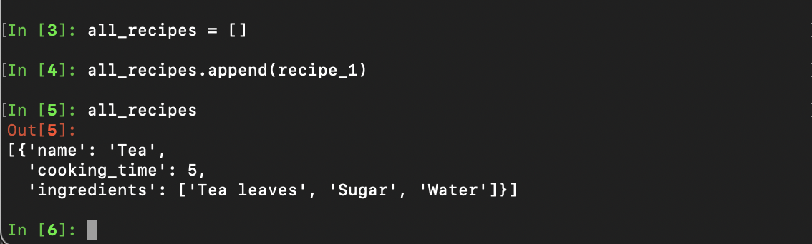
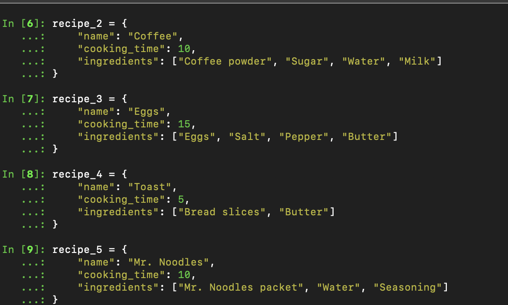
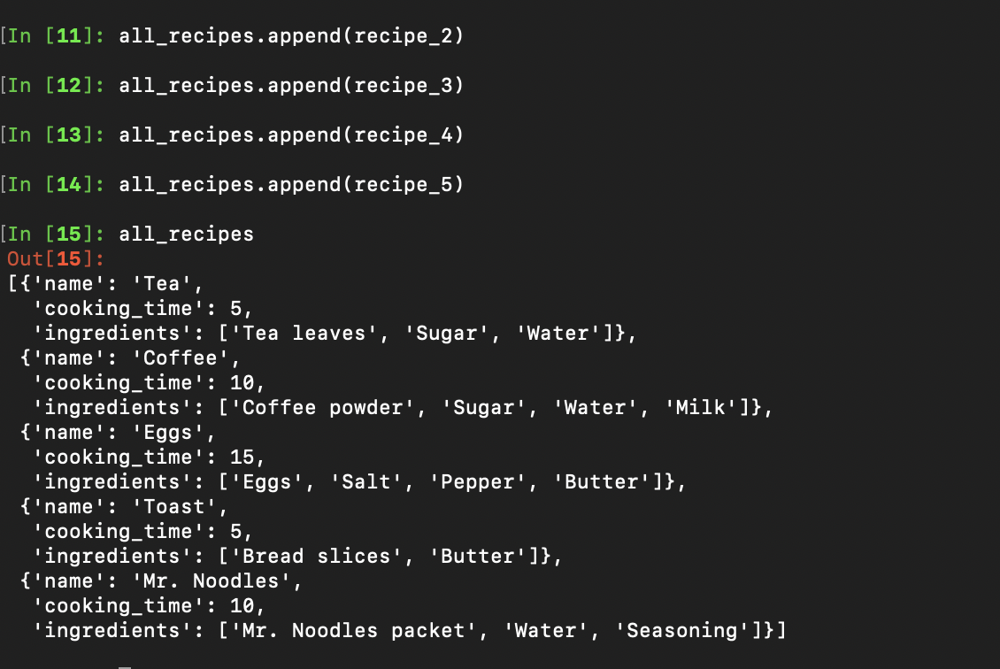
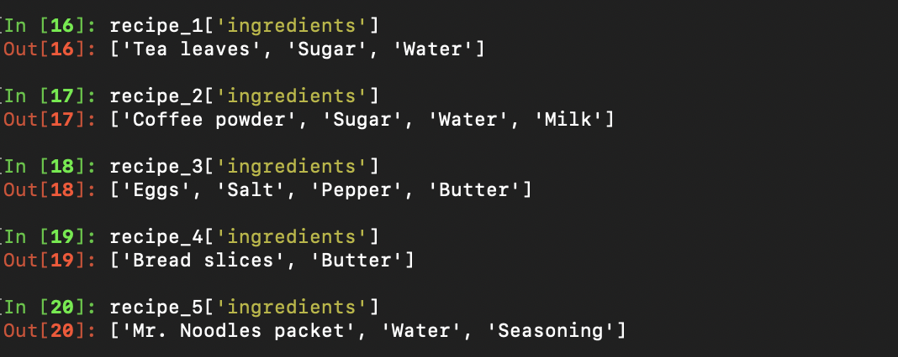

# Exercise 2

Dictionaries in Python offer felexibilityin story varied recipe data. This structure is usefull for holding result values assotiacted witha value or key. Storing these dictionaries in a list, like "all_recipes", allows easy access and organization. 

## Step 1: Create recipe_1 Structure

## Step 2: Create all_recipes Structure

Add recipe_1 to all_recipes. A List supports growth and modification making them great for this application.

## Step 3: Create More Recipes and Add Them To "all_recipes"

  

## Step 4: Print all ingredients from recipes

