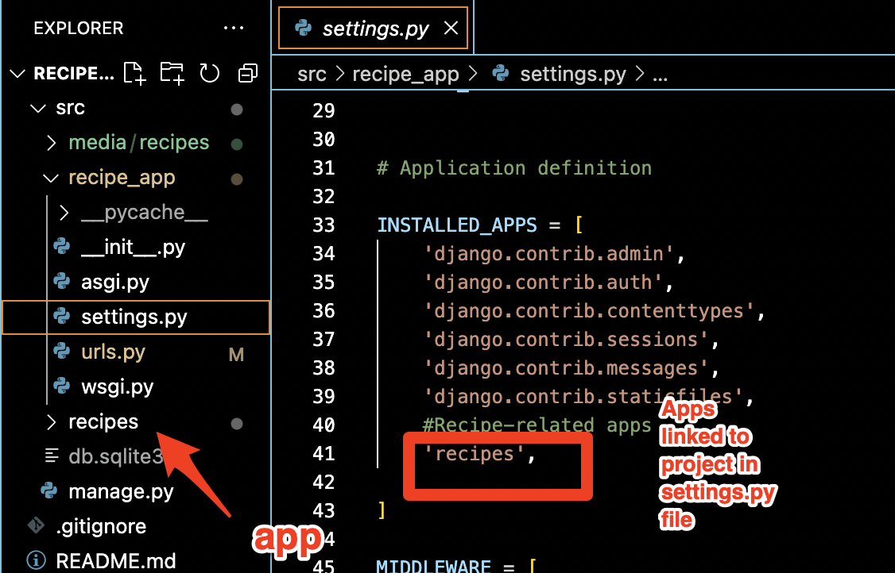

# Exercise 2.3

## Step 1: Create a Database Blueprint

## Step 2: Create App

## Step 3: Create and Register Models

## Step 4: Create and Run Tests

## Step 5: Run Server / Create Recipes Using Admin Site

View App:
<a href="https://github.com/Gregpk55/Recipe_App.git" target="_blank">Recipe App Repository</a>