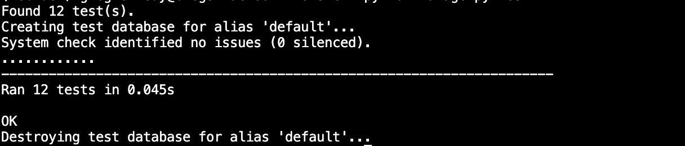

# Exercise 2.5

## Step 1: Update models if needed

## Step 2: Add Records of Recipes

## Step 3: Create a Welcome page

## Step 4: Generate a Recipe List

## Step 5: Add Recipe Details

## Step 6: Create/Run Tests 

