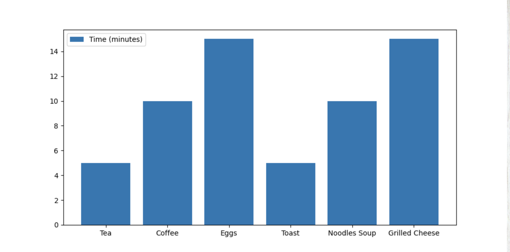
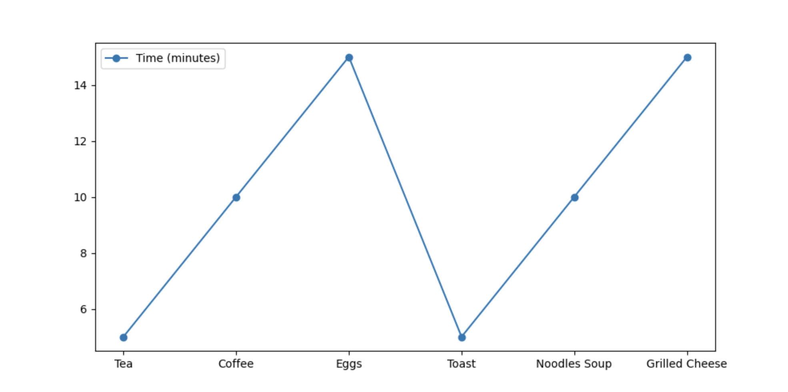
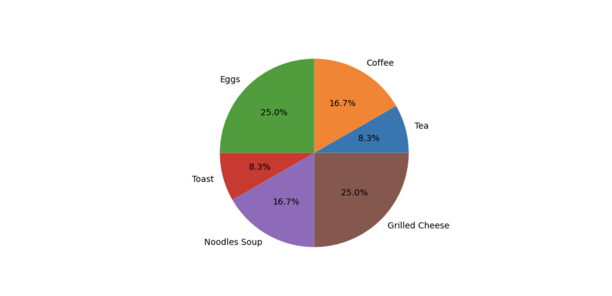

# Data Analysis

## Bar Graph

Legend displays Time in minutes.
Y-axis displays amount of minutes.
X-axis display recipes filterd to chart.

## Line Graph

Legend displays Time in minutes.
Y-axis displays amount of minutes.
X-axis display recipes filterd to chart.

## Pie Chart

Each recipe is displayed as a percent of the Pie Chart.
The higher the percent the larger the amount of time.

