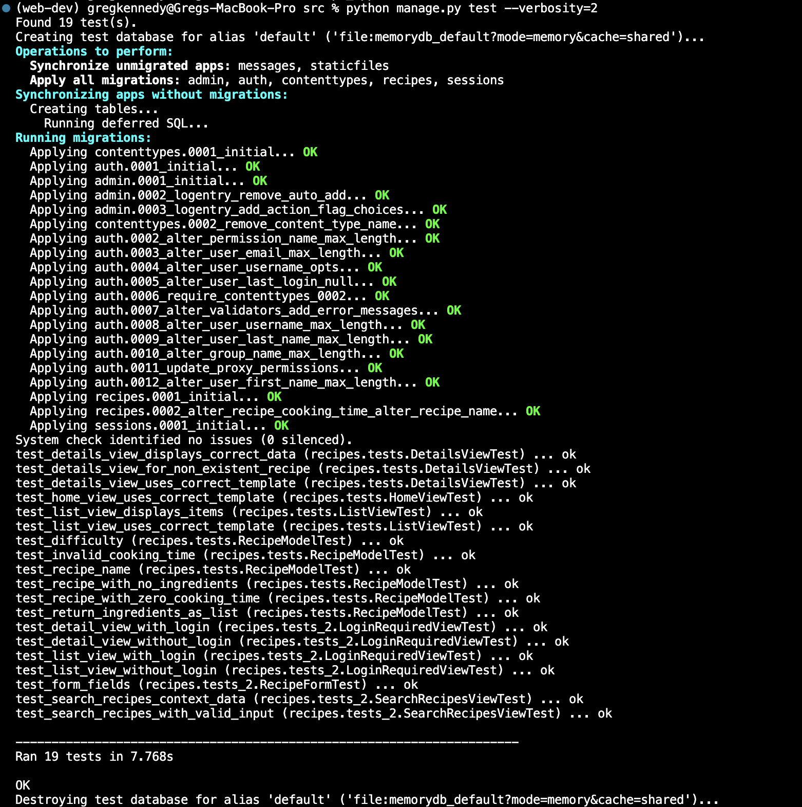

# Exercise 2.7

## Step 1 : Create User Story

[User Story](Task-2.7.txt)

## Step 2: Implement Search for Recipes

## Step 3: Create Table

## Step 4: Create chart displaying Cookingtime/Difficulty level

[Data Analysis](Data_Analysis.md)

## Step 5: Create Tests for New Functionality

View App:
<a href="https://github.com/Gregpk55/Recipe_App.git" target="_blank">Recipe App Repository</a>

