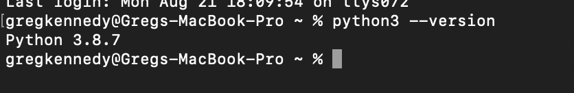
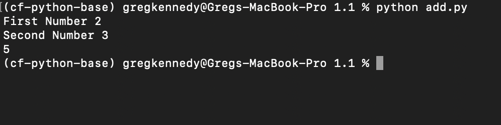
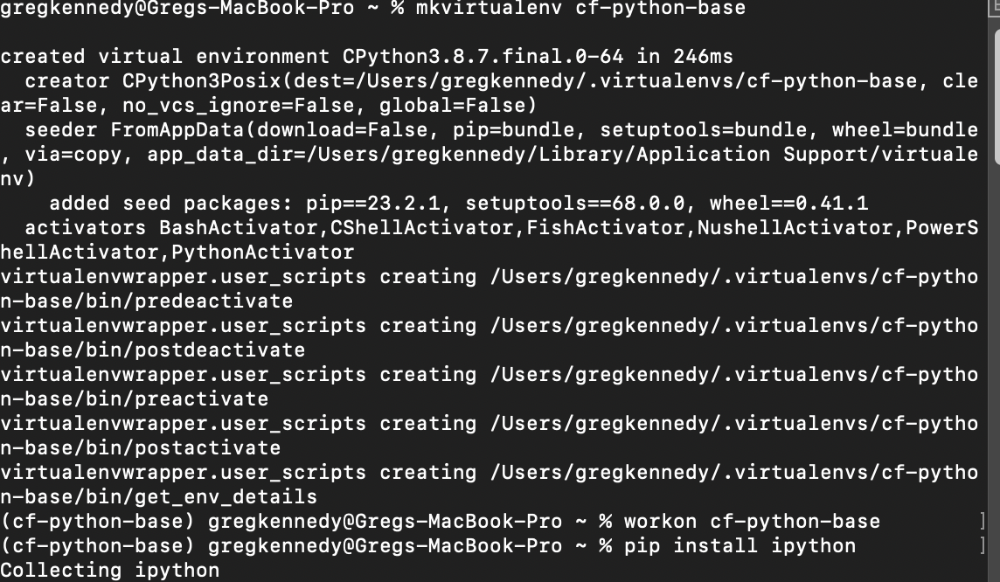
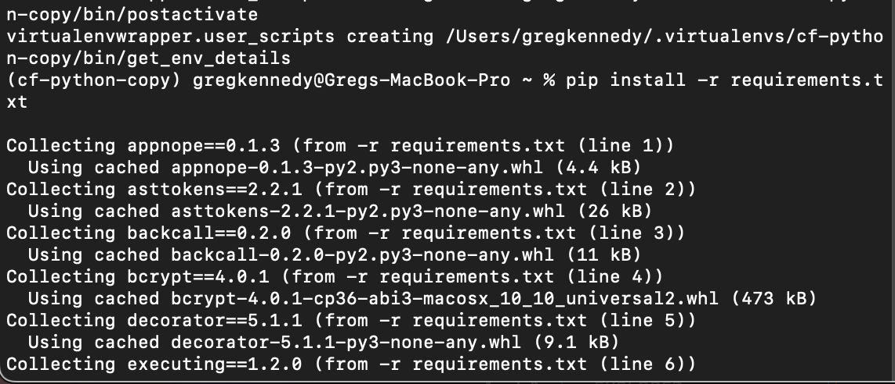

# Excercise 1

## Step 1: Install Python 3.8.7

1. Download and install Python 3.8.7 from the [official website](https://www.python.org/downloads/).
2. Verify the installation by opening a terminal or command prompt and running the following command:
python --version

## Step 2: Set Up a Virtual Environment

Navigate to your project directory or a directory where you want to set up the virtual environment.

## Step 3: Create a Python Script

Create python script using you favorite IDE
[View add.py](1.1/add.py)

## Step 4: Set Up IPython Shell

If you haven't installed IPython in your virtual environment, do so using:Step1
pip install ipython

## Step 5: Export a Requirements File

After installing all necessary packages in your virtual environment, you can export a list of them to a `requirements.txt` file using:
pip freeze > requirements.txt

This `requirements.txt` file can later be used to replicate the environment.

